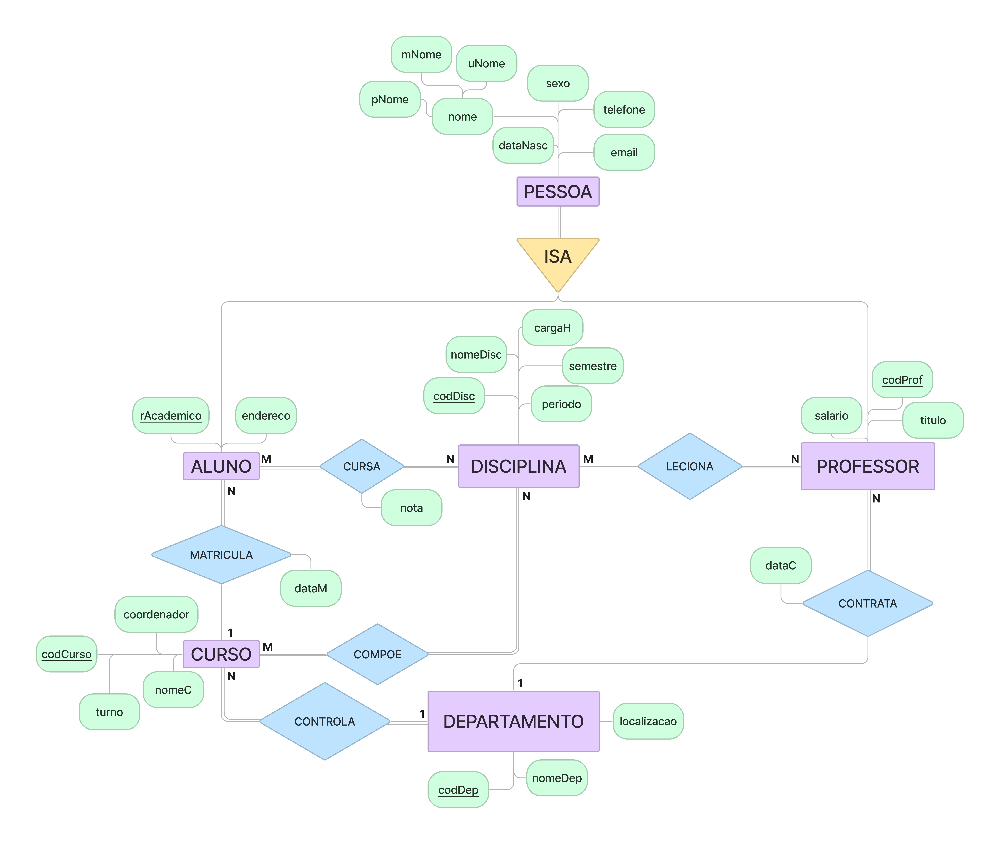
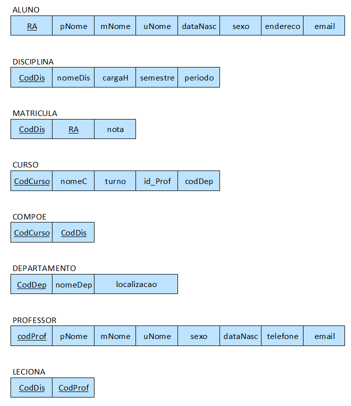
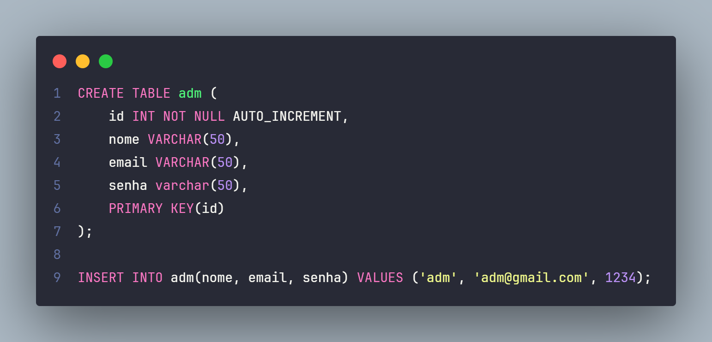
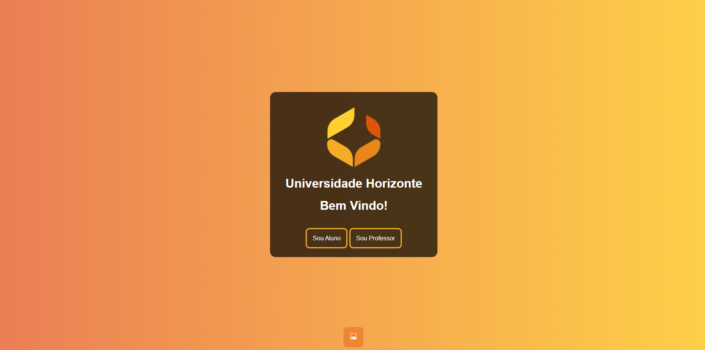
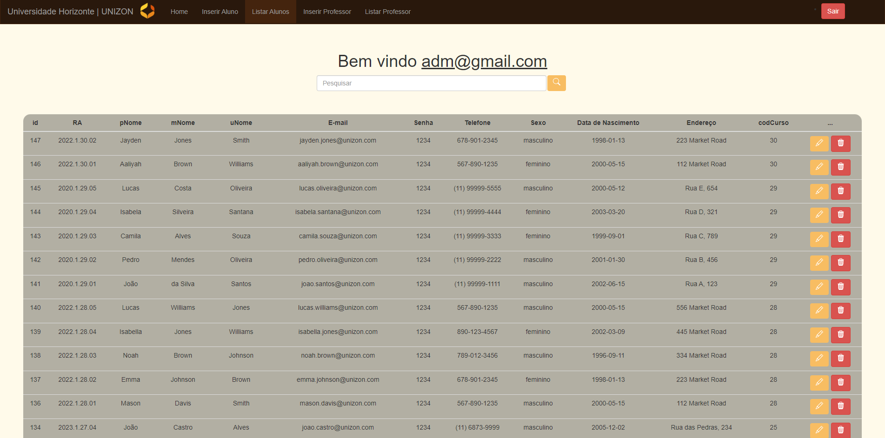

# unizon-db

## Overview

This repository hosts the project files for the development of Universidade Horizonte (UNIZON), a web application designed for managing student and professor data. The application allows users to authenticate login into the system, as well as perform basic CRUD (Create, Read, Update, Delete) operations on both student and professor models.

It was developed as part of the Database course at Federal University of Alfenas.

## Entity-Relationship Model

The initial design of the database schema was created using Figma, a collaborative design tool. The Entity-Relationship Model (ERM) depicts the relationships between different entities in the database.

### Relational Model and Normalization

Following the MER design, the database schema underwent normalization to ensure data consistency and reduce redundancy.

### Data Definition Language/Data Manipulation Language

The database schema was translated into SQL scripts located at `src/Unizon.sql`. These scripts contain the Data Definition Language (DDL) statements necessary to create the database structure. Additionally, sample data was seeded into the database using Data Manipulation Language (DML) commands.

### Landing Page

Upon accessing the application, users are directed to the authentication login page. Here, they can log in with their credentials to gain access to the system.

### Registers

Once logged in, users have the ability to view all registered students or professors within the system. This section provides a comprehensive overview of all entities stored in the database.

## Team Members
- Bárbara Silveira Rodrigues
- Daniel Costa Lima
- Leonardo Reis Coimbra
- Renan Magalhães Lage

***